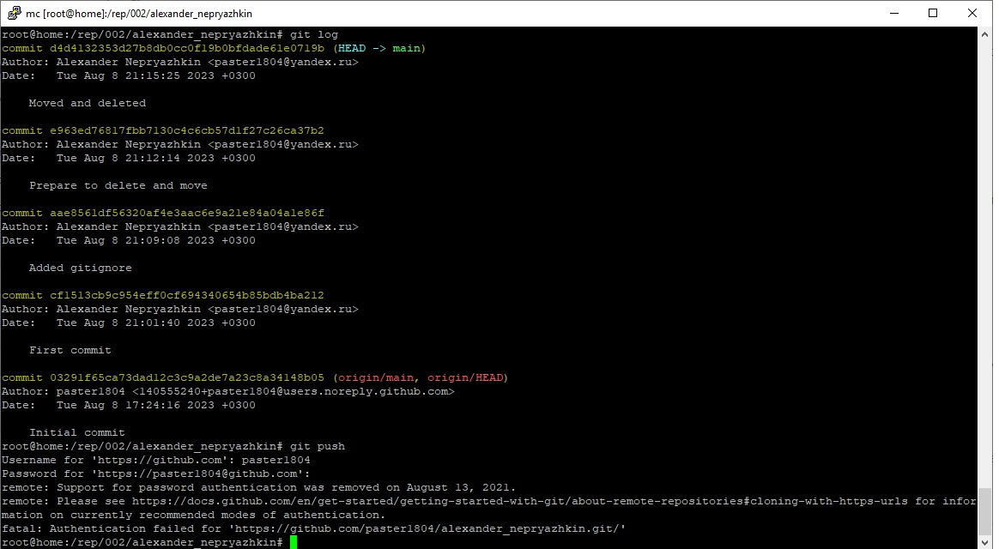

# alexander_nepryazhkin
# Домашнее задание к занятию «Системы контроля версий»

 Local .terraform directories

*ls*/.terraform/*

#исключить все файлы во всех дректориях “.terraform”

#.tfstate files

*.tfstate

*.tfstate.*

#исключить все файлы с рсширением “tfstate”

#исключить файлы содержащие в названии “.tfstate.”

#Crash log files

crash.log

crash.*.log

#исключить все файлы с названием “сrash.log”

#исключить все файлы начинающиеся с “сrash.” и имеющие расширение “log”

#Exclude all .tfvars files, which are likely to contain sensitive data, such as
#password, private keys, and other secrets. These should not be part of version
#control as they are data points which are potentially sensitive and subject
#to change depending on the environment.

*.tfvars

*.tfvars.json

#исключить все файлы с расширением “.tfvars”

#исключить все файлы заканчивающиеся на “tfvars.json”

#Ignore override files as they are usually used to override resources locally >
#are not checked in

override.tf

override.tf.json

*_override.tf

*_override.tf.json

#исключить все файлы с названием “override.tf”

#исключить все файлы с названием “override.tf.json”

#исключить все файлы заканчивающиеся на “_override.tf”

#исключить все файлы заканчивающиеся на “_override.tf.json”

##Залить репозитори   сюда не смог, постоянно ошибка авторизации, а в чем дело пока не понял, но не в пароле...

